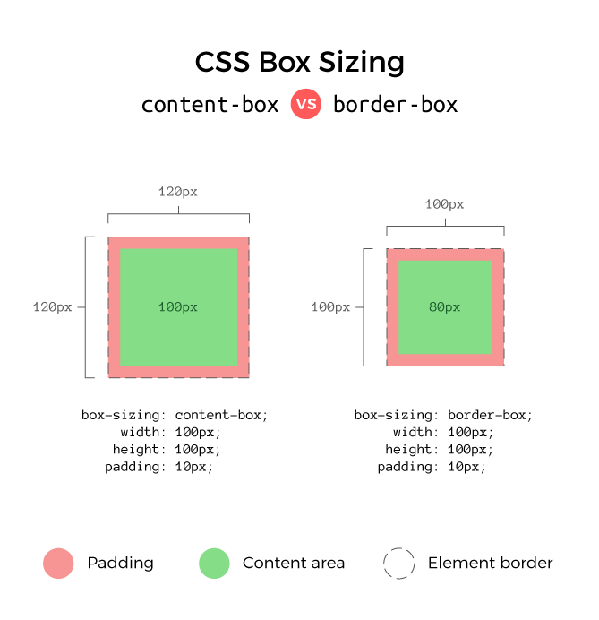

## 개요

개발을 진행하면서 CSS를 적용하다 보면, 생각보다 계산을 할 부분이 많아진다.

나는 `box-sizing`을 수정할 수 있다는 걸 몰랐을 때는 거의 계산왕이었다.

상위 컴포넌트에서 width를 100vw로 주고, 하위 컴포넌트에서 50%로 주고,, 여기까지는 쉽다.

그런데 상위 부분에 padding이나, border을 추가하면 그만큼 하위에서는 빼줘야 한다.

## 문제점

초반에는 계산기로 빼면서 계산을 했는데, 중첩될 수록 복잡해지고, 유지보수가 어려워진다.

그래서 찾아보다가, 꿀 같은 정보를 얻게 되었다.

`global style에 border-box를 사용하면 쉽게 계산할 수 있다.`

## 해결 방법



### box-sizing: content-box; (default 값)

HTML 요소들은 기본값 (default) 으로 `content-box` 박스 모델을 사용한다.

이 모델에서는 요소의 `width`와 `height`가 content 영역만을 포함한다.

padding과 border가 추가될 경우 요소의 전체 크기가 변경될 수 있다.

예를 들어, 다음과 같은 CSS 코드를 살펴보자

```css
.box {
  width: 100px;
  height: 100px
  padding: 10px;
  border: 1px solid black;
}
```

`.box` 요소의 실제 너비 = `200px + 20px(padding) + 2px(border)`

따라서 요소가 차지하는 실제 공간은 예상보다 커질 수 있다.

<br/>

### box-sizing: border-box (추천하는 값)

반면에 `box-sizing: border-box;`를 적용하면 width와 height가 content, padding, border를 모두 포함한 박스의 크기로 정의된다.

이 모델을 사용하면 요소의 크기를 지정할 때 padding과 border를 추가로 고려하지 않아도 되므로
계산이 쉽다.

예를 들어, 다음과 같은 CSS 코드를 살펴보자

```css
.box {
  box-sizing: border-box;
  width: 100px;
  padding: 10px;
  border: 1px solid black;
}
```

이 경우 `.box` 요소의 너비는 정확히 `200px`로 유지된다.

padding과 border는 요소의 내부에 포함되어 실제로 차지하는 공간이 예측 가능하게 된다.

## 결론

따라서 `box-sizing: border-box;`를 전역적으로 설정하면 모든 요소들이 일관된 크기 계산 방식을 따르게 되어 레이아웃을 보다 효율적으로 관리할 수 있게 된다.

이는 웹 개발에서 레이아웃 설계와 유지보수를 보다 쉽고 예측 가능하게 만드는 중요한 방법입니다.

```css
*,
*::before,
*::after {
  box-sizing: border-box;
}
```

메모하고 꼭 사용해보길 바란다.
