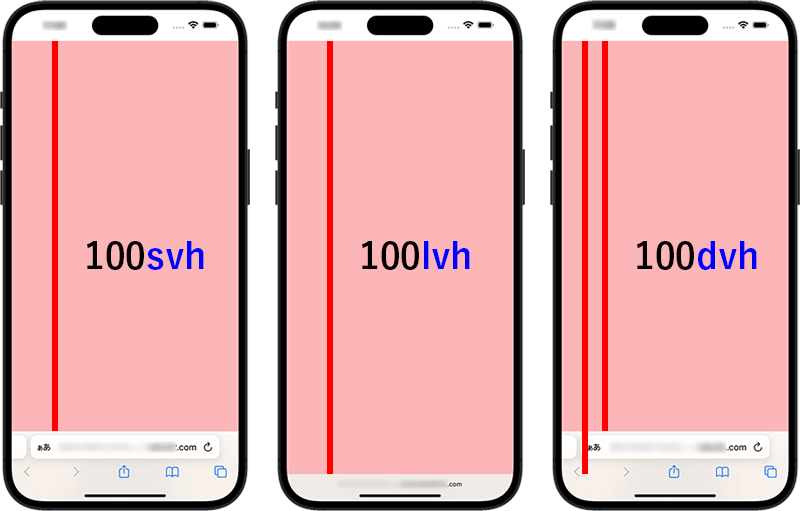

## 개요

웹사이트를 모바일이나 태블릿 화면에서 제공할 때의 문제점을 다들 겪어봤을 것입니다.

100vh로 지정하더라도, 툴바, 주소 표시줄의 UI가 표시되어 계획했던 크기와 맞지 않는 문제입니다.

이를 해결하기 위한 viewport 단위를 알아보겠습니다

https://caniuse.com/viewport-unit-variants

Google 크롬, Microsoft Edge, Safari, Firefox 및 주요 브라우저는 지원됩니다.



## 본론

### 1. dvh (Dynamic  **Viewport Height)**

dvh는 주소 표시줄이 노출이 되고, 안되고 상관 없이 현재 보여지는 뷰포트 높이를 동적으로 가져옵니다.

dvh를 모든 브라우저에서 사용가능한 것은 아니므로, 이전 브라우저도 대응하기 위해 `100nh`도 병행해 작성하는 것이 좋습니다.

```jsx
.foo {
    height: 100vh;
    height: 100dvh;
}
```

### 2. svh (Short Viewport Height)

svh는 사용자 화면 기준으로 가장 짧은 뷰포트 값을 가져옵니다.

주소 표시줄이 없어져도 기존 주소표시줄의 높이 값을 뺀 나머지 값을 가져옵니다.

```jsx
.foo {
    height: 100vh;
    height: 100svh;
}
```

### 3. lvh (Large Viewport Height)

lvh는 svh와는 반대로 사용자 화면 기준으로 가장 긴 뷰표트 값을 가져온다.

주소 표시줄이 있더라도 주소 표시줄이 없을 때의 총 화면의 길이를 가져온다.

```jsx
.foo {
    height: 100vh;
    height: 100lvh;
}
```

가로폭에서도 똑같이 「svw, lvw, dvw」 단위를 지정할 수 있습니다.

그 외, vi(svi, lvi, dvi) 등 인라인 방향의 viewport의 사이즈나, vb(svb, lvb, dvb)와 같은 블록 방향의 viewport의 사이즈의 단위도 있습니다.

### 참고

https://blanche-toile.com/web/large-small-and-dynamic-viewport-units
