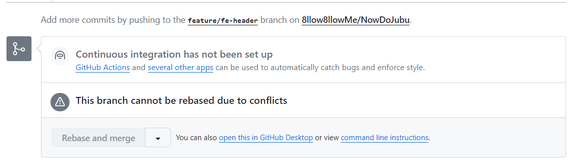

## 개요

지난 달, 팀원들과 토이 프로젝트를 진행하는 중이었다.
기존에는 Gitlab을 사용했는데, 그 때는 작업중이던 브랜치에서 기존의 develop 브랜치에 병합할 때 딱히 문제가 발생하지 않았다.
그러다가, 이번에 Github로 프로젝트를 진행하던 도중, 팀 리더가 `Rebase and merge`로 진행하라고 전파했고, 그냥 알겠다 하고 진행을 하려고 했다.

하지만, 아무래도 Front 와 Back 서버를 한 레포지토리에서 개발을 진행하다보니, 내가 병합할 시기에 브랜치를 최신 상태로 pull을 하지 않고 병합을 하려고 시도를 하게 될 때가 있다.

그러다가 아래 문구가 발생했다.

`Github This branch cannot be rebased due to conflicts`

<br>



## 문제점

이 문구를 보고 사실 겁먹지 않았다.

'아.. 이거 IDE로 돌아가서 git pull 하면 conflict난 부분 비교 화면 나오고, 최신 상태로 잘 합치면 되지!'

근데 이번에는 뭔가 이상했다..

`git pull origin develop`을 진행하고 `conflict`난 부분을 확인하고 커밋을 날렸는데, 아직도 위 문구가 해결이 되지 않는 것이다... 뭐지..? @@@@

진정하고 구글링을 하기 시작했다.

단순히 develop 브랜치를 pull 하고 끝나는 문제가 아니었다.

rebase를 사용해 작업한 브랜치에 변경 사항을 최신 commit으로 쌓아 갱신시켜야 하는 부분이었다.

## 해결방법

순서대로 한번 설명을 해보겠다.

상황은 기존 브랜치 - `develop` / 작업중이던 브랜치 - `feature`

#### 1. `develop` 브랜치 최신 상태로 업데이트

먼저 `develop` 브랜치를 최신 상태로 업데이트한다.

```bash
git checkout develop
git fetch origin
git pull origin develop
```

#### 2. `feature` 브랜치로 체크아웃

이제 작업 중인 브랜치로 돌아간다.

```bash
git checkout feature
```

#### 3. `develop` 브랜치를 `feature` 브랜치에 Rebase

이제 `develop` 브랜치의 변경 사항을 `feature` 브랜치에 rebase한다.

```bash
git fetch origin
git rebase origin/develop
```

#### 4. 충돌 해결

충돌이 발생하면 Git이 충돌 파일을 표시한다.

각 파일을 열어 충돌을 해결하고, 해결된 파일을 스테이지에 추가한다.

```bash
# 충돌 파일을 열고 해결
# 예를 들어, 파일 path/to/conflicted-file을 해결한 경우
git add path/to/conflicted-file
```

#### 5. Rebase 계속 진행

충돌을 해결한 후 rebase를 계속 진행한다.

```bash
git rebase --continue
```

이 과정을 반복하여 모든 충돌을 해결하면 된다.

#### 6. Rebase 완료 후 강제 푸시

Rebase가 성공적으로 완료되면 변경 사항을 원격 저장소에 푸시한다.

```bash
git push -f origin feature
```

#### 7. PR(풀 리퀘스트) 또는 머지

이제 `feature` 브랜치를 `develop` 브랜치로 머지할 준비가 되었다.

GitHub에서 머지를 요청할 수도 있고, 로컬에서 명령어를 사용해 직접 머지할 수도 있다.

```bash
git checkout develop
git merge feature
```

여기까지 진행하면 `feature` 브랜치가 `develop` 브랜치에 성공적으로 머지되는 것을 확인할 수 있다.

### 요약

```bash
# 1. 최신 develop 브랜치로 업데이트
git checkout develop
git fetch origin
git pull origin develop

# 2. 작업 브랜치로 체크아웃
git checkout feature

# 3. develop 브랜치를 feature 브랜치에 Rebase
git fetch origin
git rebase origin/develop

# 4. 충돌 해결 후 파일 스테이징
git add path/to/conflicted-file

# 5. Rebase 계속 진행
git rebase --continue

# 6. Rebase 완료 후 강제 푸시
git push -f origin feature

# 7. PR 생성 또는 로컬에서 직접 머지
# PR 생성 (GitHub에서)
# 또는
git checkout develop
git merge feature
```

## 결론 및 회고

기존에 존재하던 브랜치의 중간에 내 변경 사항이 들어가야 할 때, rebase를 사용해서 현재 위치한 브랜치에 데이터를 가져와 변경사항을 최신화 한 뒤, 충돌을 해결 후 기존 브랜치에 merge하는 방식으로 진행하면 된다는 것을 알게 되었다.

조만간 git에 대해 더 깊게 공부해볼 계획이다.
