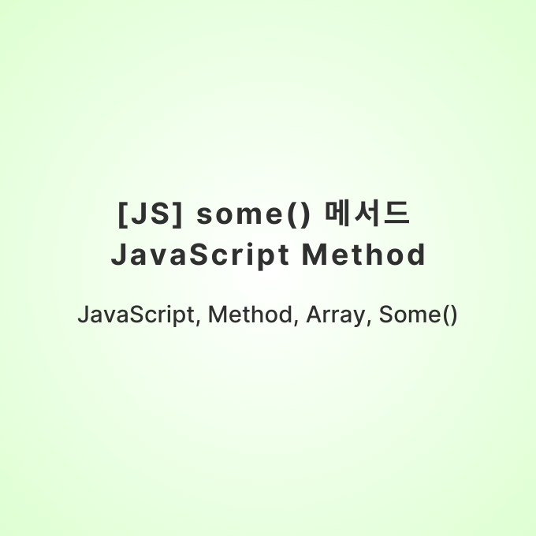

## 개요

JavaScript를 사용하여 알고리즘 문제를 풀던 도중, 배열을 순회하는 과정에서 some() 메서드를 활용하는 방법이 있다는 것을 접했습니다.

some() 메서드에 대해 공부를 한 뒤, 적용하여 문제를 수월하게 풀었습니다.

해당 문제는 백준 1966으로, 아래 링크를 누르면 확인할 수 있습니다.

[백준 1966 문제로 이동하기](https://www.acmicpc.net/problem/1966)

많은 JS 메서드를 하나씩 보다보면 한 세월 지나니,, 필요한 상황에 하나씩 익혀 봅시다.

## 반복 메서드, some()에 대하여

`Array.prototype.some` 메서드는 JavaScript 배열에서 특정 조건을 만족하는 요소가 있는지 확인하는 데 사용됩니다.

이 메서드는 배열의 각 요소에 대해 제공된 테스트 함수를 호출하며, 조건을 만족하는 요소가 하나라도 있으면 `true`를 반환하고, 그렇지 않으면 `false`를 반환합니다.

### 사용법

```javascript
arr.some(callback(element[, index[, array]])[, thisArg])
```

**callback**: 배열의 각 요소에 대해 실행할 함수. 다음 세 가지 인수를 가집니다.

- **element**: 처리할 현재 요소.
- **index** (Optional): 처리할 현재 요소의 인덱스.
- **array** (Optional): `some` 메서드를 호출한 배열.
- **thisArg** (Optional): `callback`을 실행할 때 `this`로 사용할 값.

### 반환 값

배열의 어떤 요소라도 `callback` 함수에서 `true`를 반환하면 `true`, 그렇지 않으면 `false`를 반환합니다.

### 예제

#### 기본 예제

```javascript
const array = [1, 2, 3, 4, 5]

// 배열에 짝수가 있는지 확인
const hasEvenNumber = array.some(element => element % 2 === 0)

console.log(hasEvenNumber) // true
```

#### 콜백 함수와 thisArg

```javascript
const fruits = ['apple', 'banana', 'mango', 'guava']

function checkAvailability(arr, fruit) {
  return arr.some(function (el) {
    return el === fruit
  })
}

console.log(checkAvailability(fruits, 'banana')) // true
console.log(checkAvailability(fruits, 'berry')) // false
```

### 참고 사항

- `some` 메서드는 배열을 변경하지 않습니다.
- `callback` 함수는 배열에서 실제로 존재하는 요소에 대해서만 호출됩니다. 삭제되거나 정의되지 않은 요소는 호출되지 않습니다.
- `some` 메서드는 `callback` 함수가 `true`를 반환하는 즉시 종료되며, 나머지 요소에 대한 검사를 중단합니다.

### 또 다른 예제

#### 객체 배열에서 특정 조건 확인

```javascript
const users = [
  { name: 'Alice', age: 25 },
  { name: 'Bob', age: 30 },
  { name: 'Charlie', age: 35 },
]

// 나이가 30 이상인 사용자가 있는지 확인
const hasSeniorUser = users.some(user => user.age >= 30)

console.log(hasSeniorUser) // true
```

## 백준 1966번 문제에서 적용한 방법

queue 배열 안에 value와 index를 key로 객체 배열의 데이터를 가진 상황 입니다.

```javascript
// ...

while (true) {
  // 현재 값
  let current = queue.shift()

  if (queue.some(item => item.value > current.value)) {
    queue.push(current)
  } else {
    cnt++
    if (current.index === M) {
      console.log(cnt)
      break
    }
  }
}
```

queue 배열을 0번째 값부터 꺼내 현재 값보다 큰 수가 하나라도 존재하면 `true` 반환, 아니면 `false`를 반환합니다.

그리고 current의 index와 M의 값이 같으면 출력 후 if문을 break합니다.

---

처음에는 `Math.max(...lst)`를 사용하여 최댓값을 갱신해서 현재 값과 크기 비교를 했는데, some 메서드를 사용하면 한 줄에 해결 가능하게 되었습니다.

JavaScript는 정말 무궁무진한 것 같습니다. 다음에는 다른 메서드로 찾아오겠습니다.

## 참고 블로그

- [MDN Web Docs: Array.prototype.some](https://developer.mozilla.org/en-US/docs/Web/JavaScript/Reference/Global_Objects/Array/some)
- [JavaScript Array some Method](https://www.javascripttutorial.net/javascript-array-some/)
