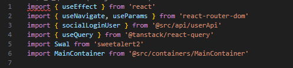
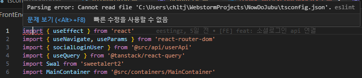

## 개요

진행하던 프로젝트가 있었다.

수정을 해야 할 부분이 있어서 VS Code로 들어와 폴더열기로 프로젝트를 열었다.

근데 갑자기, 모든 tsx 파일의 첫 번째 줄에 빨간 줄이 그어지며 오류 메세지를 발생시켰다.

#### 아래 처럼 모든 tsx 파일에서 에러 발생..



마우스를 올려 에러 메세지를 확인했다.



파싱 에러,, Cannot read file.. 어제까지만 해도 문제가 없었는데, 왜 갑자기 생긴건지는 모르겠지만, 얼른 해결해야지.

## 문제점

`Parsing Error: Cannot read file 'tsconfig.json'`

일단, tsconfig.json 파일은 TypeScript 프로젝트의 설정을 정의하는 파일이다.

이 파일은 TypeScript 컴파일러가 프로젝트를 어떻게 처리하고 컴파일할지 설정하는데 사용된다.

프로젝트 루트를 지정하고, parser Options을 설정할 수 있는데, 코드의 구문을 분석할 때 tsx파일들의 루트 경로를 지정해주지 않아 발생한 문제라는 것을 파악했다.

## 해결방법

parserOptions 에 루트 경로를 지정해주면 해결이 될 것 같다.

#### 기존 컴파일러 옵션

```jsx
parserOptions: {
  ecmaVersion: 'latest',
  sourceType: 'module',
  project: './tsconfig.json',
}
```

#### 변경한 컴파일러 옵션

```jsx
parserOptions: {
  project: './tsconfig.json',
  sourceType: 'module',
  tsconfigRootDir: __dirname,
}
```

tsconfigRootDir 옵션은 TypeScript 컴파일러가 tsconfig.json 파일을 찾는 기준 디렉토리를 명시적으로 설정하게 한다.

이 옵션을 설정하지 않으면, 기본적으로 현재 작업 디렉토리를 기준으로 tsconfig.json 파일을 찾게 된다. \_\_dirname은 현재 파일의 디렉토리 경로를 나타내므로, 이를 설정하여 정확한 경로를 지정할 수 있다.

## 결론 및 회고

tsconfig.json 파일 안에 parserOptions 설정과 compilerOptions 설정에 대해 학습하고 목적을 알게 되었다.

compilerOptions는 TypeScript 코드의 컴파일 설정을 정의하고, parserOptions는 코드의 구문 분석 설정을 정의하는 코드이다.

이 다음에는 tsconfig.json에 대해 더 자세히 학습해보는 시간을 가져보는 것이 좋겠다.
