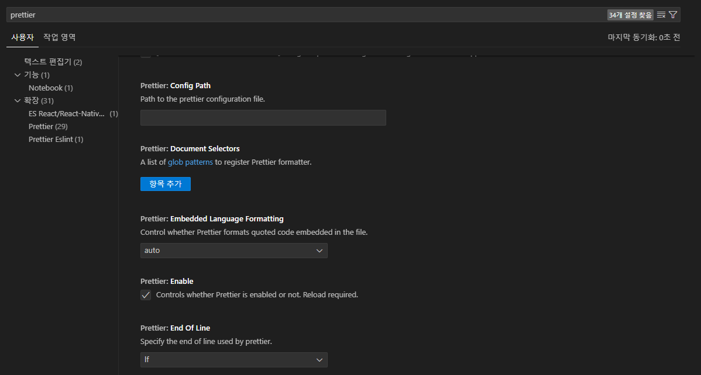
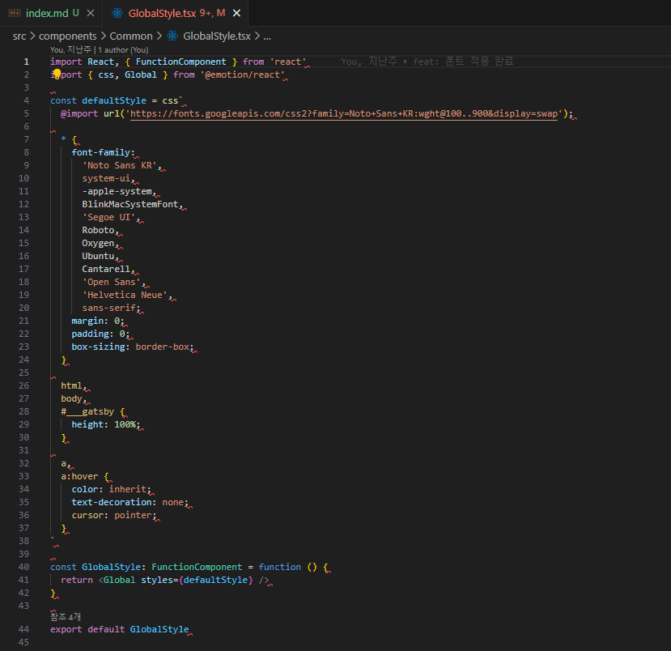

## 개요

진행하던 프로젝트가 있었다.

나는 윈도우 노트북, 맥북 노트북 두 개를 같이 사용하고, 팀원은 맥북을 사용하는데,

프로젝트 초기 설정을 할 때 prettier에 `End Of Line` 이라고, `줄바꿈 형식`을 통일해야 한다.

### 줄바꿈 형식에는 두 종류가 있다.

### 1. LF (Line Feed) - \n

LF는 유닉스 및 유닉스 계열 시스템(예: macOS, Linux)에서 사용되는 줄바꿈 문자이다.

줄의 끝을 나타내기 위해 단일 문자인 \n을 사용한다.

맥북에서는 LF가 기본 설정이라는 것이다.

### 2. CRLF (Carriage Return + Line Feed) - \r\n

CRLF는 주로 윈도우 시스템에서 사용된다.

줄의 끝을 나타내기 위해 두 개의 문자, 즉 \r(Carriage Return)과 \n(Line Feed)을 사용한다.

이는 과거 타자기에서 줄바꿈과 커서 이동을 동시에 실행하던 방식에서 유래했다.

## 문제점

우선, 현재 기본 설정을 `lf`로 바꿔보겠다. 아래 두 가지를 진행하면 된다.

### 1. .prettierrc 파일에 endOfLine 설정 변경 (현재 프로젝트 설정 지정)

```javascript{9}
{
  "printWidth": 80,
  "tabWidth": 2,
  "useTabs": false,
  "semi": false,
  "singleQuote": true,
  "quoteProps": "as-needed",
  "trailingComma": "all",
  "arrowParens": "avoid",
  "endOfLine": "lf",
  "bracketSpacing": true
}
```

### 2. VSCode 환경설정에서 EOL 수정 (앞으로 생성하는 파일에 적용할 값 지정)



2-1. 왼쪽 아래 톱니바퀴를 누르고 setting에 들어가거나, `ctrl + ,` 두 버튼을 누르면 setting 창이 뜬다.

2-2. `prettier을 검색`하면 `End Of Line` 부분이 있다. 그 부분을 하나로 변경한다.

### 문제 또 발생



`.prettierrc` 파일에서 `endOfLine` 설정을 lf로 바꿨는데, 이미 윈도우에서 만든 파일들은 `CRLF`로 저장되어 있어서 모든 파일을 하나씩 들어가서 수정해야되는 상황이 발생했다.

이 파일들을 어떻게 일괄적으로 수정할 수 있을까?

## 해결방법

### 요약하자면, 아래 코드를 한 줄씩 터미널 창에 입력하면 해결된다.

```shell
git config core.autocrlf input
git rm --cached -r .
git reset --hard
```

## 결론 및 회고

사실 프로젝트 초기 세팅을 진행할 때 미리 적용하면 이런 일이 발생하지 않는다.

하지만,, 초기 세팅도 신경써야 할 부분이 너무 많아서 깜빡하고 놓칠 수 있는 부분이라 생각한다.

이렇게 시행착오 겪으며 성장하는 것이라 생각하며..

## 참고 링크

https://docs.github.com/ko/get-started/getting-started-with-git/configuring-git-to-handle-line-endings
