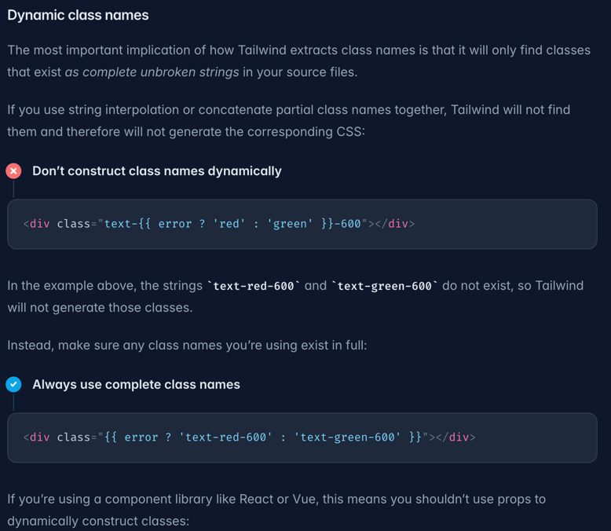

## 개요

Atomic Design Pattern과 Tailwind를 사용하여 진행한 프로젝트를 제작할 때의 일이다.

Atomic Design Pattern은 버튼, Input 창 등등 재사용할 수 있는 부분을 모두 컴포넌트화 해서 재사용하는 방법이다.

그러다보니 재사용할 때 글자 색상, 글자 크기 등 수정하고싶은 부분만 따로 props로 보내면 된다!!

여기서 문제가 발생했다..

## 문제점

상위 컴포넌트에서 props로 내리는 부분을 최소화 하고 싶어서 text-${color} 형태로 만들었더니 인식을 하지 못했다.

계속 인식하지 못하면 헷갈리지 않았을 텐데, 어느 때는 인식이 되기도 해서 더 헤맸고, 헷갈렸다.

자꾸 `text-${color}` 자체로 인식 되어 버리는 것이다..!!!

Tailwind 공식문서를 찾아보던 중,, 동적 클래스 네임을 사용하지 말라고 적힌 것을 발견했다.

왜 그럴까??

## 해결방법

Tailwind 공식문서를 찾아보던 중,, 동적 클래스 네임을 사용하지 말라고 적힌 것을 발견했다.

### [공식문서로 바로가기](https://tailwindcss.com/docs/content-configuration#dynamic-class-names)



<br>

`이거야 이거야... 내가 찾던 부분이야...!!!`

Tailwind는 처음 렌더링할 때 존재하는 className만 수정할 수 있는 값으로 인지하게 되기 때문에 text-${color} 형태는 처음에 text- 로 인식되어 수정할 수 없는 상황에 부딛히는 것이었다.

<br>

```js
<div className="text-red text-{error ? 'xl' : '4xl'} " / >
```

Tailwind는 렌더링 될 때 완전한 형태의 className만을 인식한다.

위 코드로 예시를 들어보자면, `text-red`는 존재하는 클래스로 인식이 되어, 이후에 조건식을 사용하여 다른 색상으로 바꿀 수 있다.

하지만, `text-{error ? 'xl' : '4xl'}` 이 부분은 error 부분의 값과는 상관 없이
완전한 값이 아니기에 존재하는 클래스로 인식되지 않아서 이후에 `text-xl` 로 받아도 적용이 되지 않는다.

## 결론

Tailwind는 동적 클래스를 원하지 않는다.

아무리 귀찮더라도 prop으로는 온전한 className 내려 보내도록 하자.