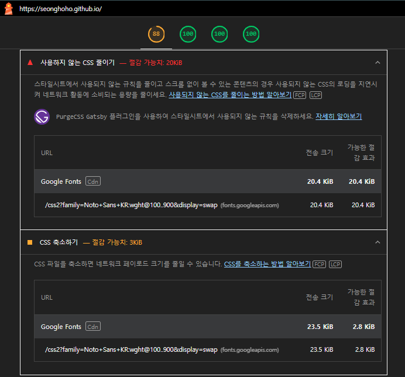
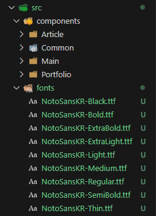
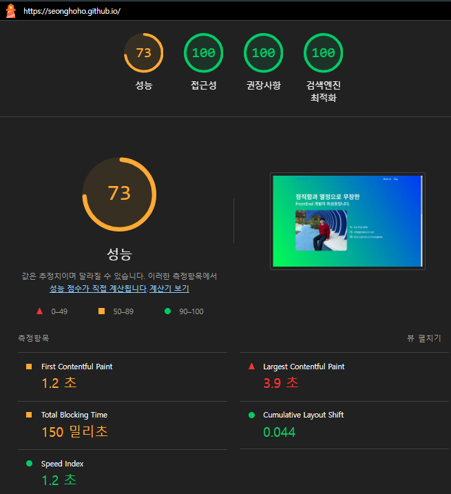
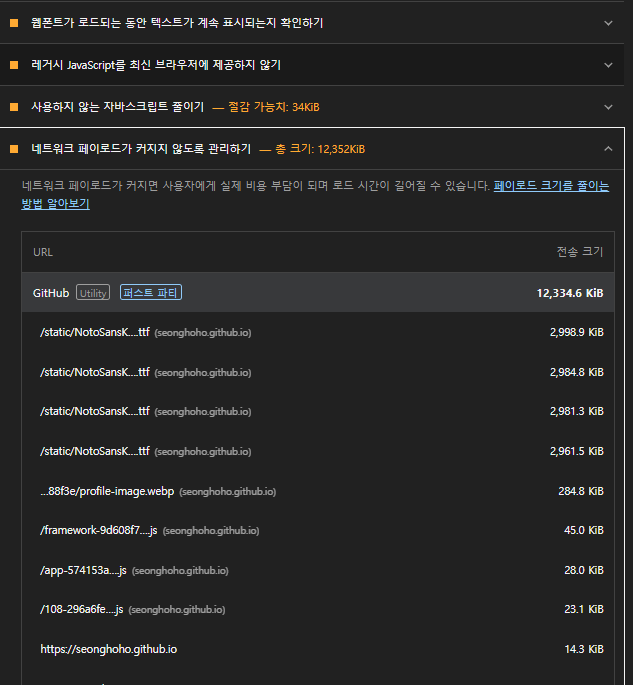
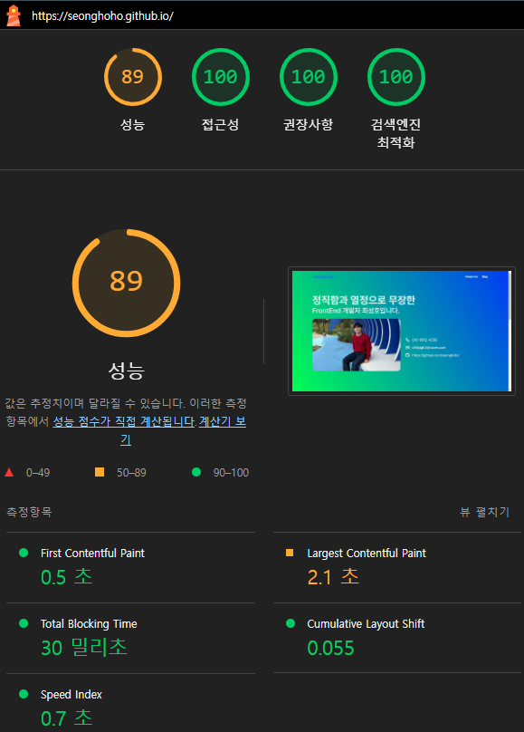

## 개요

기존 github.io 블로그에는 `@emotion`을 사용해 프로젝트에 style을 적용하고 있다.

성능 최적화를 위해 많은 SSR 방식의 Gatsby를 사용하고 있다.

F12를 눌러 `개발자도구`에 접근을 하게 되면 크롬 브라우저에서 `LightHouse`를 확장자 설치를 해서 페이지 분석을 할 수 있다.

페이지를 분석해 보았는데, 아래 화면처럼 Font 관련 문제가 발생하는 것을 발견했다.



## 문제점

Font를 Global Style에 적용할 때 웹폰트를 사용해서 적용한 부분에서 불필요한 코드 호출이 발생하는 것으로 파악했다.

이전에 진행한 프로젝트들에서 font 파일을 woff2 파일로 다운받아 프로젝트 로컬 서버에 위치시킨 후 불러오는 방식으로 사용한 경험이 있다.

url로 불러오던 웹 폰트를 local 파일을 불러오는 방식으로 바꾸면 해결이 될 것이라 판단했다.

## 해결방법

### 1. 사용하고자 하는 Font를 설치한다.

보통 눈누, 구글 폰트에서 선택해 사용한다.

[Noto Sans Kr 눈누 바로가기](https://noonnu.cc/font_page/34)

[Noto Sans Kr 구글 폰트 바로가기](https://fonts.google.com/noto/specimen/Noto+Sans+KR)

### 2. Font 파일을 프로젝트에 fonts 라는 디렉토리를 생성해서 추가한다.



위 사진처럼 추가하면 된다.

### 3. Font를 적용한 Global Style 위치에 코드를 적용한다.

아래는 기존 글로벌 스타일

```typescript
import React, { FunctionComponent } from 'react'
import { css, Global } from '@emotion/react'

const defaultStyle = css`
  @import url('https://fonts.googleapis.com/css2?family=Noto+Sans+KR:wght@100..900&display=swap');

  * {
    font-family:
      'Noto Sans KR',
      system-ui,
      -apple-system,
      BlinkMacSystemFont,
      'Segoe UI',
      Roboto,
      Oxygen,
      Ubuntu,
      Cantarell,
      'Open Sans',
      'Helvetica Neue',
      sans-serif;
    margin: 0;
    padding: 0;
    box-sizing: border-box;
  }
`

const GlobalStyle: FunctionComponent = function () {
  return <Global styles={defaultStyle} />
}

export default GlobalStyle
```

```typescript
@import url('https://fonts.googleapis.com/css2?family=Noto+Sans+KR:wght@100..900&display=swap');

```

이 부분 대신 아래 font-face를 넣는다.

```typescript
// 폰트 파일 import
import NotoSansKRThin from '../../fonts/NotoSansKR-Thin.ttf'

const defaultStyle = css`
  @font-face {
    font-family: 'Noto Sans KR';
    src: url(${NotoSansKRThin}) format('truetype');
    font-weight: 100;
    font-style: normal;
  }
```

### 포인트

`@font-face`를 적용하는 부분이 포인트다.

```
  @font-face {
    font-family: 'Noto Sans KR';
    src: url(${NotoSansKRBlack}) format('truetype');
    font-weight: 900;
    font-style: normal;
  }
```

## 또 다시 문제 발생..🚨🚨🚨

다시 배포하고 light house를 확인했는데,,,



아.. 변경 전에는 88점이었는데,, 73점으로 하락했다..

원인을 파악해서 다시 수정해보자..ㅋㅋ



이 두 부분이 문제인 것 같다.

1. Font 로딩이 완료되기 전, 기본 Font로 미리 보여줬다가 변경하도록 하는 로직을 추가하자.

2. NotoSansKR ttf 파일의 크기가 5MB가 넘는다. 용량을 줄이는 방법을 찾아보자.


```typescript
  @font-face {
    font-family: 'Pretendard';
    src: url(${PretendardThin}) format('woff2');
    font-weight: 100;
    font-style: normal;
    font-display: swap;
  }
```

`font-display: swap;`  이 코드를 작성하면 기본 폰트 먼저 보여주다가 로딩 끝나면 변경된다.

그리고 파일 크기가 작은 `pretendard woff2` 파일들로 변경해봤다.


## 결론

이렇게 진행을 하니, 성능이 개선되었다.

..? 1점 개선되었는데.. 10점은 이미지 렌더링 문제 부분이라서 그 부분은 조만간 수정해보려 한다. ㅎ_ㅎ 



고작 1점일 수 있겠지만, 확실히 사용자 접근성은 증가되었다는 것에 큰 의의를 두고, 조금이라도 더 나은 페이지가 되었다면 고생한 가치가 있다고 생각한다. 

어제보다 오늘 더 나은 방향으로 발전하는 개발자가 됩시다~~